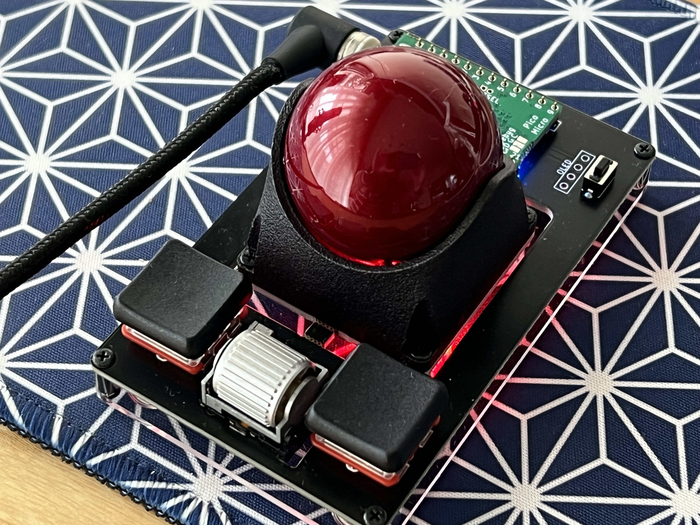

## meishi Trackball Module

### Board

- Sparkfun Pro Micro RP2040

## Usage

Copy `lib/adns5050.rb` to `/lib` directory of "PRK DRIVE".

See [wiki/require](https://github.com/picoruby/prk_firmware/wiki/require) for details.

### License

Copyright © 2024 HASUMI Hitoshi. See MIT-LICENSE for further details.

